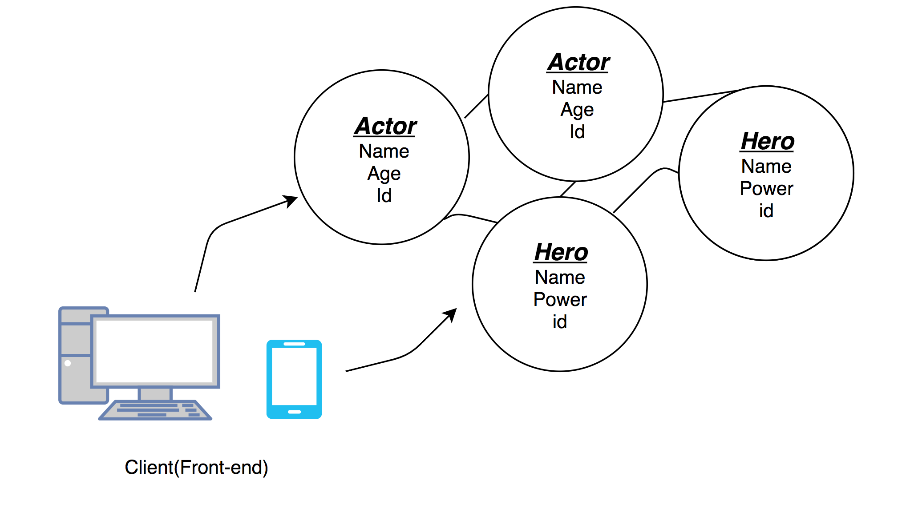

## Getting started with GraphQL
```
  - git clone https://github.com/yogeshvar/GraphQL.git
  - cd GraphQL
  - npm install
  - nodemon app.js
```
## Define your Schema 
- In the project; Two GraphQLObjectType are used.
```
var heros = [
    {name:'Flash',power:'Fastest man',id:'1',actorId:'1'},
    {name:'Thor',power:'Son of Thunder',id:'2',actorId:'2'},
    {name:'Iron man',power:'Not a human',id:'3',actorId:'3'},
];
var actors = [
    {name:'Grant Gustin',age:'28',id:'1'},
    {name:'Chris Hemsworth',age:'34',id:'2'},
    {name:'Robert Downey, Jr.',age:'53',id:'3'},
]
```

## Justify your rootQuery:
Understand the schema and find your rootQuery

RootQuery for this repo:


## Type Relation: 
```
const Hero = new GraphQLObjectType({
    name: 'Hero',
    fields: () => ({
        id: {type:GraphQLID},
        name: {type:GraphQLString},
        power: {type:GraphQLString},
        actor :{
            // type: Actor (GraphQLObjectType) 
            type: Actor,
            resolve(root,arguments){
                return _.find(actors,{id:root.actorId})
            }
        } 
    })
});
```

## Querying:
- Use the define GraphQLObjectType
### Example
```
{ actor(id:"1"){id name} } returns {name:'Grant Gustin',age:'28'}
{ hero(id:'2'){name id} returns {name:'Thor',id:'2'},
```

### Helpful links:
- http://facebook.github.io/graphql/draft/
- https://graphql.org/learn/
